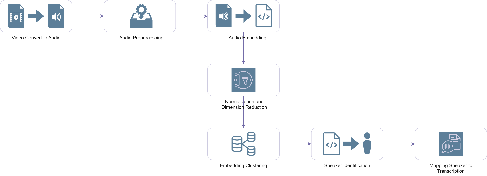
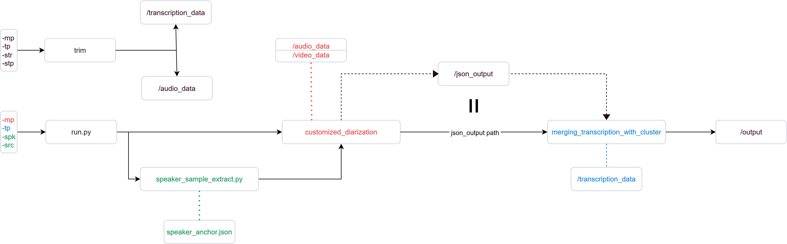

# Speaker_Diarizartion
This program performs speaker diarization by implementing the whole workflow from scratch. It supports detailed model tuning and customized parameters adjustment at each stage of the workflow.  
- The folders **video_data**, **silero-vad**, **pyannote_models**, and **spkrec-ecapa-voxceleb** are too large to upload to GitHub.  Download the required ZIP files [here](https://drive.google.com/drive/folders/1cVUwoWZqzHzqUD7muNZe0YgVxplYf9y3?usp=drive_link), extract them, and replace the corresponding empty folders.  

## Architecture

## Workflow

## File Hierarchy

## Technical Document

